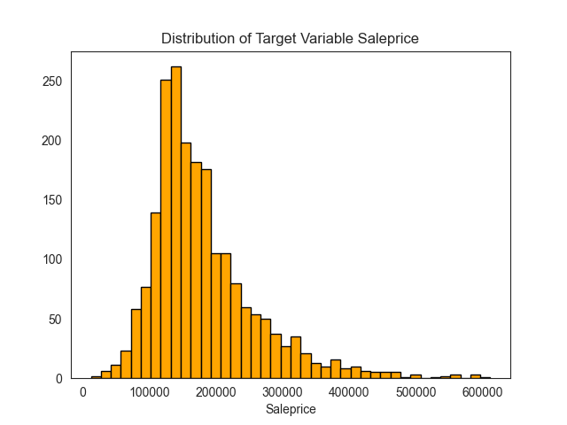

## Background

The problem revolves around predicting the house prices in Ames, Iowa, based on various features provided in the dataset. The goal is to develop a regression model that accurately estimates the sale price of a house using the available information.

The Ames, Iowa dataset obtained from Kaggle contains a comprehensive set of features related to residential properties, including information about the physical attributes, location, and other relevant characteristics. By analyzing these features and their relationships with the sale prices, the aim is to build a predictive model that can assist in determining the approximate value of a house in the Ames area.

The challenge lies in identifying the most influential features that significantly impact the house prices and constructing a robust regression model that can effectively capture the underlying patterns and variations in the data. Additionally, addressing potential issues such as missing values, outliers, and categorical variables requires careful preprocessing and feature engineering to ensure accurate predictions.

Ultimately, the developed model should be capable of accurately estimating the sale price of a house in Ames, Iowa, based on the given set of features, enabling individuals and real estate professionals to make informed decisions regarding property transactions in the area.

### The Data

The Data was obtained from Kaggle [click here to download the data](https://www.kaggle.com/competitions/project-2-regression-challenge-123/data)

### Some of the important features from the data

|Feature|Type|Dataset|Description|
|---|---|---|---|
|**overall_qual**|*integer*|Ames,IA Houseprices|The Overall material and finish quality ranges from 1to 10.| 
|**gr_liv_area**|*float*|Ames,IA Houseprices|Above Ground living area in Square Feet |
|**garage_area**|*float*|Ames,IA Houseprices|Size of the Garage in Square Feet|
|**1st_flr_sf**|*float'*|AMes,IA Houseprices|First Floor Square Feet|
|**neighborhood**|*category*|Ames,IA Houseprices|Physical locations within Ames City Limits|
|**ms_zoning**|*category*|Ames,IA Houseprices|Identifies the general zoning classification of the sale|
|**exter_qual**|*category*|Ames,IA Houseprices|Exterior Material Quality|
|**kitchen_qual**|*category*|Ames,IA Houseprices|Kitchen Quality|
|**garage_type**|*category*|Ames,IA Houseprices|Builtin Garage or Attached or Detached Garage|
|**saleprice**|*float*|Ames,IA Houseprices|The property's Saleprice in Dollars|

## Part I

- [x] Data Cleaning and Exploratory Data Analysis

- Data was obtained from Kaggle and some columns with more than 50% missing data were removed and other columns with lesser missing values were imputed with different imputation methods. Data was split into numerical and categorical features for cleaning and data exploration. Missing data in categorical columns were imputed with most frequent values.

- Outlier checks were performed using boxplots

- Some of the outliers were capped at 75th percentile values and correlation between numeric variables were checked using heatmaps in seaborn library.

## Part II

- [x] Preprocessing

- Performed dummy encoding of categorical variables using onehotencoder
- scaling was performed using standardscaler
- Pipelines were used to train the model
- Dummyregressor was used to compare the model with baseline model
- Polynomial features was used to check the interactions between the variables

## Part III

- [x] Feature Extraction and Modeling

- Performed Linear Regression using four numerical variables that are highly correlated and achieved an rsquared score of 73 on train and 77 on test data
- Compared model with the baseline model
- Introduced categorical variables into the model and removed one numeric variable
- Tried and tested various models using column transformers and pipelines 
- Generated MSE, RMSE and MAE and compared with baseline 
- Finally achieved rsquared score of 83.9% using 9 variables out of 81 variables

**Baseline MSE: 5983691627.56332**
**Test MSE: 938053042.9447733**

==========

**Baseline RMSE: 77354.3252026887**
**Test RMSE: 30627.651606755182**

==========

**Baseline MAE: 58082.873996560935**
**Test MAE: 21629.8337939106**

### Conclusion:

The most important factors that are determining the saleprice in Ames, IA are Overall quality of the house, Ground Living area, Garage area, Kitchen Quality, which are explaining about 78% varaiability in saleprice, other factors like Kitchen Quality, Neighborhood, External Quality, MS Zoning that is zoning classification are also important for people purchasing a house in Ames. For instance if the house falls under Floating village residential zoning the average sale price is about 200,000USD and the neighborhood Stonebrook looks to be in high demand and neighborhoods like Meadow village and Briardale have an average saleprice of 100,000 USD.

### Next steps 

There may be other factors influencing house prices like interest rates, Government subsidies and inflation. We may need to include these factors as well for accurate predictions as real estate prices have high association with interest rates along with the factors that were mentioned in conclusion
